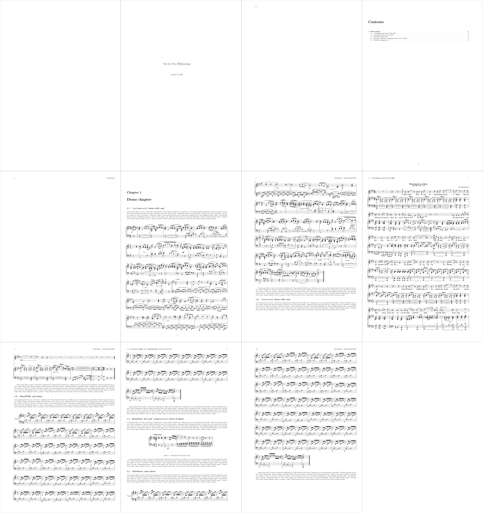

# Nota

**Nota** is a LaTeX package *under construction* to include properly formatted musical notation in a document.

## Examples

Grids of the demo documents to demonstrate the macros and capabilities of the package. With ``\usepackage{blindtext}`` to fill the doc with text for demoing purposes.

A4 paper, with all margins set to 20mm, with document class article.

A3 book, with two side option, meaning different inner and outer margins. With bigger music notation rendering.

### How to run the demo

To run this demo you need **python**, **LaTeX** and optionally **MuseScore cli** (comes with Musescore installation). You can simply run ``make`` in the terminal and build steps are automated there. If you don't have MuseScore, you should comment out the appropriate line in the ``.tex`` files where ``\includescore{*.mscz}`` is evoked. In the ``makefile`` it uses ``pdflatex`` to compile the latex files, but you can change it to the compiler of your liking (``xelatex``, ``lualatex``). I have tested them all three.

## How it works

The package uses the **Verovio** library to render scores and automatically passes the appropriate options to embed them properly formatted in your LaTeX doc with auto generated LaTeX code.

### Techologies used

- **LaTeX** [[website](https://www.latex-project.org)] [[github](https://github.com/latex3)] LaTeX is a high-quality typesetting system; it includes features designed for the production of technical and scientific documentation. LaTeX is the de facto standard for the communication and publication of scientific documents. LaTeX is available as free software.
    
    - Required LaTeX Packages: **graphicx** [[ctan](https://ctan.org/pkg/graphicx)], **pdfpages** [[ctan](https://ctan.org/pkg/pdfpages)], **kvoptions** [[ctan](https://ctan.org/pkg/kvoptions?lang=en)]

- **Verovio** [[website](https://www.verovio.org/index.xhtml)] [[github](https://github.com/rism-digital/verovio)] Verovio is a fast, portable and lightweight library for engraving Music Encoding Initiative (MEI) digital scores into SVG images. Verovio also contains on-the-fly converters to render Plaine & Easie Code, Humdrum, Musedata, MusicXML, EsAC, and ABC digital scores.

- **The Music Encoding Initiative - MEI** [[website](https://music-encoding.org)] [[github](https://github.com/music-encoding)] The Music Encoding Initiative (MEI) is an open-source effort to define a system for encoding musical documents in a machine-readable structure. MEI brings together specialists from various music research communities, including technologists, librarians, historians, and theorists in a common effort to define best practices for representing a broad range of musical documents and structures. 

- **SMuFL** [[website](https://w3c.github.io/smufl/latest/)] [[github](https://github.com/w3c/smufl)] SMuFL is a specification that provides a standard way of mapping the thousands of musical symbols required by conventional music notation into the Private Use Area in Unicode’s Basic Multilingual Plane for a single (format-independent) font.

- **MuseScore** [[website](https://musescore.org/en)] [[github](https://github.com/musescore/MuseScore)] MuseScore is an open source and free music notation software. Used through the mscore cli interface.

### Design and use

#### ``\usepackage[font=, unit=<4.5-12>]{nota}``

- ``font`` **:** Select one of **SMuFL** fonts included in Verovio. Fonts supported: ``Leipzig``, ``Bravura``, ``Gootville``, ``Leland``. See [SMuFL fonts](https://book.verovio.org/advanced-topics/smufl.html). *Default in package and Verovio is ``Leipzig``.*

- ``unit`` **:** The MEI unit (1⁄2 of the distance between the staff lines) (min: ``4.5``; max: ``12.0``) See **Verovio** docs: [Units and page dimensions](https://book.verovio.org/advanced-topics/controlling-the-svg-output.html#units-and-page-dimensions) | [Scaling](https://book.verovio.org/advanced-topics/controlling-the-svg-output.html#scaling). *Default in the package is ``6.875``.*

#### ``\includescore{<filepath>}``

Include the score in a "inline" manner, where systems are broken down to individual graphics and are rendered in the document in between text, with a ``\flushbottom`` formatting to fill the pages. No header display.

#### ``\fullscore{<filepath>}``

Include the score as complete pages, meaning each page is a separate graphics, leaving the complete formatting of the page to Verovio. With header.

#### ``\examplescore{<filepath>}``

Example score, should be used for smaller examples, for use in floating environments. Renders full page, and crops it down, should honor custom system breaks.

### Supprted input file formats

All the types that **Verovio** supports should accepted: *MEI* ``.mei``, *Humdrum* ``.krn``, *Musicxml* ``.mxl``, *Plain and Easie* ``.pae``, *ABC* ``.abc``, *CMME* ``.cmme.xml``. The package supports *MuseScore* ``.mscz`` files, using the mscore cli to first convert it to *musicxml* and then sends over to verovio for rendering. Sibelius users use the [sibmei](https://github.com/music-encoding/sibmei) plugin for Sibelius to export to *.mei* file or export to *musicXML*, although both of these options seem to not be available in their free tier option called *Sibelius First*.

## to - do

- [x] mscore files directly.
- [x] manual verovio option settings from sty package options and 
- [ ] macro options (like independent margins for scores)
- [ ] dynamic unit setting?
- [x] add and test proper "example" functionality
- [ ] a way to check if the produced files are up to date, and should not build them again, probably using the .aux file.

- Demos
    - [x] simple article with even margins
    - [x] book twoside
    - [ ] a3paper with independent score margin

## Bugs or Limitations

- Verovio limitations
    
    - Verovio doesnt support "two side" style render with odd and even margins. ← *this has been overcome with a workaround.*

    - supports only up to 50mm (500px) margins ← *this has been overcome with a workaround.*

    - lyrics font need a fix, it renders incorrectly after the cairo py lib pass

- my limitations
    
    - Not sure how to properly consolidate it to a standalone LaTeX package yet!